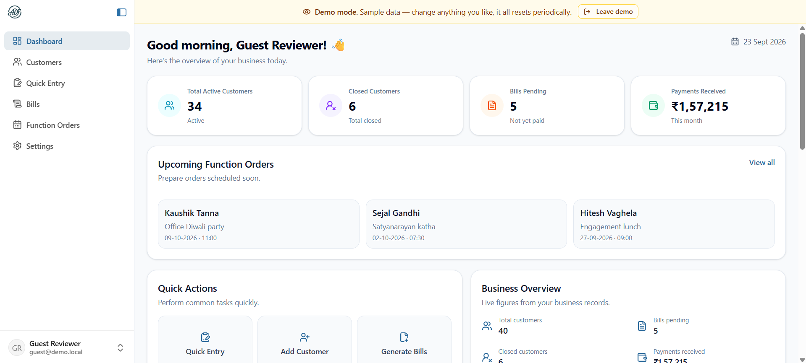
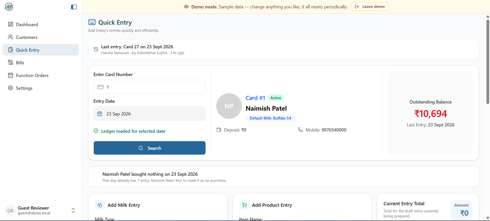
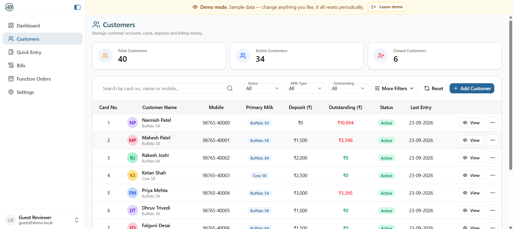
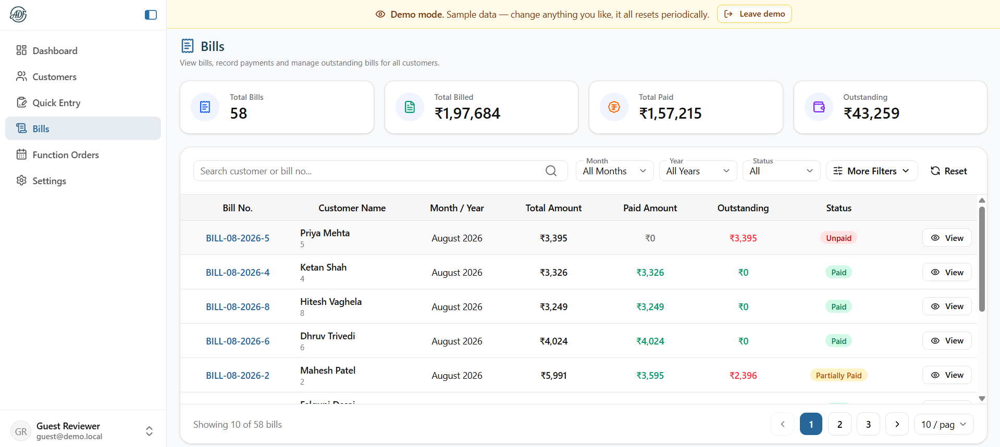
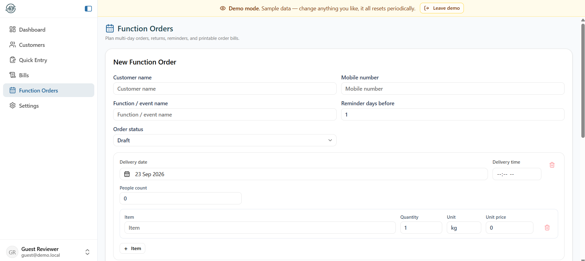
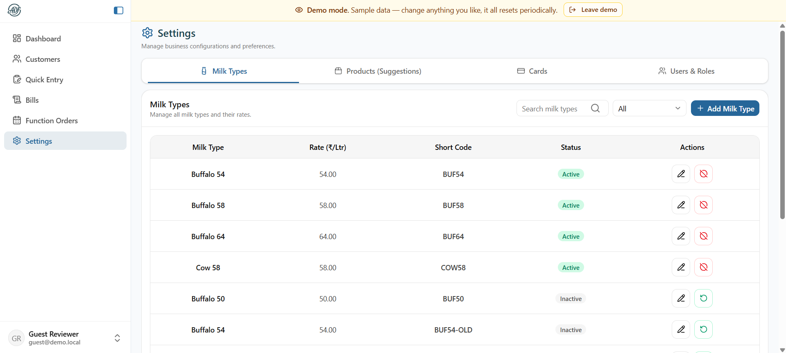
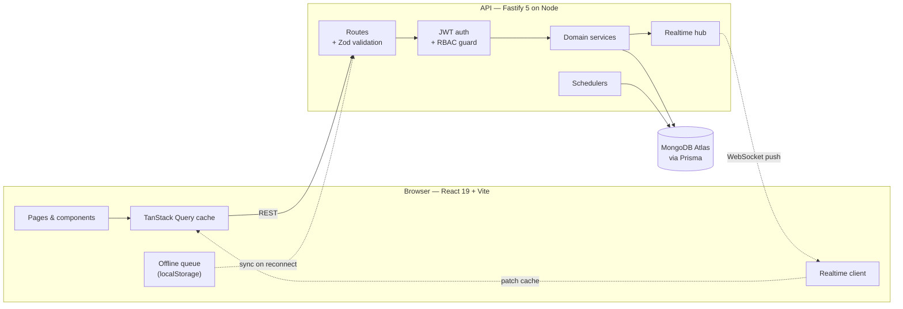
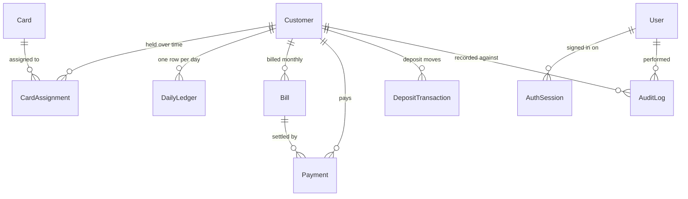

<div align="center">

# 🥛 Amrut Ledger

**A production ledger, billing and catering system that replaced the paper books of a working dairy farm.**

Not a tutorial project — this runs the daily operations of a real business in Rajkot, Gujarat.

[](https://react.dev/)
[](https://www.typescriptlang.org/)
[](https://fastify.dev/)
[](https://www.prisma.io/)
[](https://www.mongodb.com/atlas)
[](https://tailwindcss.com/)
[](https://vite.dev/)
[](#-testing)

</div>

---

## 📖 The problem

A dairy farm tracked every customer in handwritten books: who took how many litres of which milk, what else they bought, who paid and who still owed. Every month someone sat down and added up a year's worth of columns by hand.

That works until it doesn't. Books get wet. A page goes missing and a month's income goes with it. Two people cannot write in the same book at once, and nobody can answer "what does card 42 owe us?" without finding the book first.

**Amrut Ledger** is the replacement. Deliveries are entered by card number on a phone while the round is happening, bills are generated for the month with balances carried forward automatically, and the outstanding total for any customer is one search away.

---

## ✨ What it does

### 📒 Daily ledger
- **Card-number entry** — customers are addressed by the physical card they already carry, so the round is worked in the same order as before
- **Back-dated entries** — a day missed on the round can be filled in later against the card the customer actually held that day
- **"Bought nothing" marker** — closes off a day explicitly, so a blank day is never confused with one nobody reached yet
- **Works offline** — entries queue in the browser when signal drops on the round and sync when it returns

### 🧾 Billing and payments
- **Monthly bills** per customer with milk and product breakdowns, and opening balances for customers migrated mid-stream
- **Carry-forward** — an unpaid balance rolls into a later bill without ever being counted twice
- **Payments** recorded against a bill, with security deposits usable as credit, reversals, and a receipt number per payment
- **Payment received date** — a payment written in the physical book days earlier carries the day it was taken, not the day it was typed in
- **PDF bills, receipts and payment history**, generated in the browser

### 🎉 Function orders (catering)
- Multi-day orders with per-day items, people counts and delivery times
- **Dispatches and returns** tracked per item, so a customer is billed on what they actually kept
- **Preparation list** — a scheduler totals the items due over the next days, so two orders needing 11 kg and 4.5 kg of the same sweet show as one 15.5 kg line to weigh out

### 🔐 Access control
- Four roles — **owner, manager, employee, guest** — over **34 granular permissions**, enforced on every route and mirrored in the interface
- Seniority rules: nobody can modify an account at or above their own level
- A **read-only guest** role powers the public demo

### ⚡ Live sync
- Changes are pushed over **WebSockets** to every open device and applied straight to the client cache, so a second tablet updates without refetching
- Payloads are **permission-gated per connection** — a device never receives a record its account may not read

---

## 📸 Screenshots

> These are placeholders. Drop PNGs into `docs/screenshots/` using the filenames below and they will appear here.

| Dashboard | Quick Entry |
|---|---|
|  |  |

| Customers | Bill detail |
|---|---|
|  |  |

| Function orders | Settings |
|---|---|
|  |  |

---

## 🏗️ Architecture



**How a write travels:** the route validates with Zod → the auth guard checks the permission → the service runs the change inside a Prisma transaction → the realtime hub pushes the new record to every *other* connected device → those clients patch their cache in place instead of refetching.

---

## 🗃️ Data model

The core of the schema — 15 models in total, plus 10 embedded types and 12 enums.



Ledger entries, bill line summaries and function-order items are **embedded documents**, not separate collections — they are only ever read with their parent, so a join would buy nothing. That is the one place the design leans on MongoDB rather than treating it as a relational database with extra steps.

Two conventions worth knowing before reading the code:

- **Money is stored as whole rupees in `Int` columns.** No floats anywhere in the money path, so totals never drift.
- **A business date is the Asia/Kolkata calendar day**, stored as UTC midnight. A delivery at 11pm belongs to that day's round, not the next one.

---

## 🛠️ Tech stack

| | Backend | Frontend |
|---|---|---|
| **Core** | Fastify 5 · Node · TypeScript 6 | React 19 · Vite 8 · TypeScript 6 |
| **Data** | Prisma 6.19 · MongoDB Atlas | TanStack Query 5 · Zustand 5 |
| **Validation** | Zod 4 | Zod 4 · React Hook Form |
| **Styling** | — | Tailwind CSS 4 · Radix UI · Lucide |
| **Realtime** | `@fastify/websocket` | Native WebSocket client |
| **Auth** | JWT · bcrypt · httpOnly cookies | In-memory access token |
| **Docs** | Swagger / OpenAPI at `/docs` | — |
| **Testing** | Vitest | — |
| **Hosting** | Render | Vercel |

TypeScript runs strict on both sides, with `exactOptionalPropertyTypes` and `noUncheckedIndexedAccess` on the backend and `noUnusedLocals` on the frontend.

---

## 📁 Project structure

```
amrut-ledger/
├── amrut-backend/
│   ├── prisma/
│   │   ├── schema.prisma          # 15 models, 12 enums, 10 embedded types
│   │   ├── seed.ts                # refuses to run unless you name the database
│   │   └── backfill-*.ts          # one-off data migrations
│   └── src/
│       ├── app/
│       │   ├── auth/              # permission matrix: 34 permissions x 4 roles
│       │   ├── db/                # prisma access, pagination, search escaping
│       │   ├── jobs/              # scheduler status registry
│       │   ├── middleware/        # authenticate, authorize, error handler
│       │   ├── observability/     # request ids, Server-Timing, slow-request log
│       │   ├── plugins/           # cors, jwt, swagger, websocket, prisma
│       │   └── realtime/          # hub, socket route, change publisher
│       ├── modules/               # 12 domains, each route/controller/service/schema/types
│       │   ├── auth/  bills/  cards/  customer/  daily-ledger/
│       │   ├── demo/  function-orders/  milk-types/
│       │   └── product-suggestions/  system-jobs/  users/  audit/
│       └── config/env.ts          # every environment variable, validated with Zod
│
└── amrut-frontend/
    └── src/
        ├── components/            # 88 components, incl. a Radix-based ui/ kit
        ├── pages/                 # 8 routes, lazily loaded
        ├── services/              # API layer, query keys, offline queues, realtime
        ├── store/                 # Zustand: auth, modals, sidebar
        ├── hooks/                 # permissions, media query, offline sync
        └── utils/                 # currency, dates, PDF generation
```

Roughly **45,000 lines of TypeScript** — 15,000 backend, 30,000 frontend.

---

## 🚀 Getting started

### Prerequisites

- **Node.js `^20.19` or `>=22.12`** and npm — Vite 8 enforces this
- A **MongoDB** connection string — [Atlas](https://www.mongodb.com/atlas) free tier works. Prisma's MongoDB connector needs a **replica set**, which Atlas gives you by default; a plain local `mongod` does not.

### 1. Clone and install

```bash
git clone https://github.com/naimishsojitra124/amrut-ledger.git
cd amrut-ledger

cd amrut-backend && npm install
cd ../amrut-frontend && npm install
```

### 2. Configure the backend

```bash
cd amrut-backend
cp .env.example .env
```

Fill in `DATABASE_URL` and both JWT secrets (32 characters minimum — the app refuses to start otherwise):

```bash
node -e "console.log(require('crypto').randomBytes(32).toString('hex'))"
```

### 3. Generate the Prisma client and push the schema

```bash
npm run prisma:generate
npm run prisma:push
```

### 4. Seed sample data *(optional)*

The seed **deletes every record first**, so it refuses to run unless you name the target database and it matches `DATABASE_URL`:

```bash
npm run seed -- --force --db your-database-name
```

It prints a generated password for the seeded staff accounts — it is shown once and not stored anywhere.

### 5. Configure the frontend

```bash
cd ../amrut-frontend
echo 'VITE_API_BASE_URL=http://localhost:5000' > .env
```

### 6. Run both

```bash
# terminal 1
cd amrut-backend && npm run dev     # http://localhost:5000

# terminal 2
cd amrut-frontend && npm run dev    # http://localhost:3000
```

API documentation is at **http://localhost:5000/docs** in development.

---

## ⚙️ Environment variables

### Backend

| Variable | Default | Notes |
|---|---|---|
| `DATABASE_URL` | — | **Required.** MongoDB connection string |
| `JWT_ACCESS_SECRET` | — | **Required**, minimum 32 characters |
| `JWT_REFRESH_SECRET` | — | **Required**, minimum 32 characters |
| `JWT_ACCESS_EXPIRES_IN` | `15m` | Access tokens are short by design |
| `JWT_REFRESH_EXPIRES_IN` | `30d` | Rotated on every refresh |
| `BCRYPT_SALT_ROUNDS` | `12` | |
| `PORT` / `HOST` | `5000` / `0.0.0.0` | |
| `CORS_ORIGIN` | `http://localhost:3000` | Comma-separated. **Required in production** |
| `COOKIE_SECURE` / `COOKIE_SAME_SITE` | `false` / `lax` | Set `COOKIE_SECURE=true` behind HTTPS |
| `ENABLE_API_DOCS` | on outside production | An open map of every route is free reconnaissance |
| `DB_TRANSACTION_TIMEOUT_MS` | `20000` | Raise it when the database is far from the app |
| `FUNCTION_REMINDER_ENABLED` | `true` | Catering preparation scheduler |
| `FUNCTION_REMINDER_DAYS_AHEAD` | `2` | How far ahead the preparation list looks |
| `FUNCTION_REMINDER_INTERVAL_MINUTES` | `60` | |
| `DEMO_MODE` | `false` | ⚠️ Wipes and re-seeds the database on a schedule |
| `DEMO_RESET_INTERVAL_HOURS` | `6` | |

> **⚠️ `DEMO_MODE=true` is destructive.** The reset job deletes every collection in whatever database `DATABASE_URL` points at. A demo deployment must have its own database.

### Frontend

| Variable | Notes |
|---|---|
| `VITE_API_BASE_URL` | API origin, or `/api` when proxying through Vercel |
| `VITE_REALTIME_URL` | WebSocket origin. Needed when the API is proxied, since rewrites do not carry WebSocket upgrades |
| `VITE_API_TIMING` | Set to `true` to log server timings in the console |

---

## 🧪 Testing

```bash
cd amrut-backend
npm test            # 72 tests across 9 files
npm run test:watch
```

The suite covers the parts where a mistake costs money or leaks data: billing arithmetic and carry-forward selection, deposit credit rules, the permission matrix, back-dated ledger entries resolving to the right card, search-input escaping, payment date handling, and realtime event naming.

---

## 🔒 Security

Security work that went beyond the defaults:

- **Regex injection / ReDoS** — Prisma's `contains` compiles to a MongoDB `$regex`, so a search term like `(a+)+$` is a denial-of-service primitive. Every search input is escaped and length-capped through one helper, and a test pins it.
- **NoSQL operator injection** — request validation rejects object-shaped values where a scalar is expected, so `{"$ne": null}` cannot reach a query.
- **Token handling** — the access token lives only in memory (never `localStorage`), the refresh token is an httpOnly cookie, and refresh tokens rotate on use with a short grace window so concurrent tabs do not sign each other out.
- **Account lockout** after repeated failed logins.
- **Rate limiting** on authentication endpoints.
- **CSP, HSTS** and related headers on the deployed frontend.
- **Swagger is off in production by default** — an unauthenticated map of every route is free reconnaissance.
- **Permission-gated realtime** — a WebSocket payload is only attached if that connection's role may read the resource.

---

## 📈 Observability

Every response carries `X-Request-Id`, `X-Server-Time-Ms` and a `Server-Timing` header, so slow requests can be split into server time versus network time from the browser's own devtools. Requests over a threshold are logged with their route and duration — which is how the cross-region database round trip between the app and the database region was identified as the real latency cost, rather than guessing.

---

## 🚢 Deployment

| Piece | Platform | Notes |
|---|---|---|
| Frontend | **Vercel** | `vercel.json` sets the CSP and rewrites `/api/*` to the backend |
| Backend | **Render** | Set `NODE_ENV=production`, `CORS_ORIGIN`, `COOKIE_SECURE=true` |
| Database | **MongoDB Atlas** | Keep it in the region closest to the API |

Because the realtime hub keeps its connections in process memory, the API is designed to run as **a single instance**. Scaling out needs a shared bus such as Redis first.

---

## 🗺️ Roadmap

- [ ] Preparation list as a printable kitchen sheet
- [ ] Shared realtime registry so the API can scale past one instance
- [ ] Automated backups with a restore drill
- [ ] Pruning of expired auth sessions
- [ ] CI pipeline running typecheck, lint and tests on every push

---

## 🤝 Contributing

This runs a real business, so changes are reviewed carefully. If you spot something:

1. Open an issue describing the problem before writing code
2. Fork, branch from `main`, and keep commits focused
3. `npm test` and `npx tsc --noEmit` must pass on the backend, and `npm run build` on the frontend
4. Open a pull request explaining the behaviour change, not just the diff

---

## 📬 Contact

**Naimish Sojitra**

[](https://github.com/naimishsojitra124)

---

<div align="center">

Built to replace a stack of paper books, and it did.

</div>
